# The price of ignorance

Do altruistic drivers actually speed traffic up, or do they just get exploited by
the greedy ones?

This repo extends Brian Skinner's *[The price of anarchy is maximized at the
percolation threshold](https://arxiv.org/abs/1404.2935)* (arXiv:1404.2935) from a
population that is either entirely selfish or entirely centrally-planned to a
**mixed population**: a fraction `α` of drivers route to minimise the *total*
commute time, and `1 - α` route to minimise their own. Everything is solved as a
convex quadratic program with [Clarabel](https://clarabel.org), plus a closed-form
solution of the two-road case.

The short answer is **both things are true at once, and they are the same
phenomenon**:

* Total commute time really does fall as `α` rises — but the gains are
  front-loaded and saturate at a finite `α* < 1`, past which extra altruists
  accomplish nothing.
* Every unit of that gain is collected by the selfish drivers. Altruists always
  experience a *longer* commute than selfish drivers, and on the lattice they end
  up worse off than **everybody** was under pure anarchy.
* The percolation threshold `p_c ≈ 0.6447` bounds the whole phenomenon. Below it
  altruism is both valuable and personally expensive; just above it the selfish
  equilibrium is already optimal, and altruism becomes simultaneously useless and
  free.
* Adding altruists is not even monotonically helpful: on ~9% of networks there is
  a range of `α` over which converting selfish drivers into altruists makes the
  average commute *worse*. The effect is real but small (≤0.4% of `C_opt`).

And once drivers are also **ignorant** about which roads are fast
([arXiv:2503.09684](https://arxiv.org/abs/2503.09684)), that last effect stops
being small and takes over:

* Ignorance corrects the same error altruism corrects, so the two are
  **substitutes, not complements**. Either one alone can reach the social
  optimum; using both overshoots it.
* Past a critical ignorance level, **recruiting altruists actively slows traffic
  down** — by 5% at `p_c`, and by 20% at heavy ignorance. This holds over 57% of
  the `(p, ω)` plane.
* There is a closed-form trade-off: a uniform population reaches the optimum at
  altruism level `γ* = (2 − 3ω)/(2 − ω)`. It gives `γ* = 1` with perfect
  knowledge, hits **exactly zero at `ω = 2/3`** — rederiving the ignorance
  paper's threshold from the altruism side — and goes *negative* beyond it,
  where the corrective role would have to be played by spite.

**But on real road networks the reversal does not happen.** Part III takes the
same questions to the Transportation Networks benchmark (Sioux Falls, Eastern
Massachusetts, Anaheim) with BPR costs and real OD matrices. There, ignorance is
*harmful* rather than helpful, and altruism helps **more** as drivers get worse
informed, not less. The lattice's over-correction is real but lives in a corner
of parameter space that real networks are not in — the deciding assumption is
that every lattice path crosses exactly `2L` roads.

**And the same asymmetry decides whether altruism can survive at all.** Part V
lets drivers copy whoever got home sooner, turning `α` from a dial into a state
variable. On the lattice altruism dies out in every regime tested and ignorance
only widens the sacrifice. On Sioux Falls it is the reverse: past `ω = 0.2` a
lone altruist is already the *faster* driver, so the population settles at a
stable mixture that captures 25–100% of the achievable gain with nobody
enforcing anything. Ignorance is what makes unselfishness pay for itself.

## Contents

```
poi/lattice.py    the papers' directed lattice, plus Pigou and a 3D BCC variant
poi/qp.py         the mixed-equilibrium convex QP (Clarabel) + a degeneracy certificate
poi/ignorance.py  perceived-cost mixing, and the ignorance/altruism composition
poi/irregular.py  networks with unequal path lengths, to test that assumption
poi/bpr.py        real road networks: TNTP data, BPR costs, Frank-Wolfe solver
poi/stochastic.py idiosyncratic driver error with tunable correlation, + logit SUE
poi/pigou.py      exact closed-form two-road solution, with and without ignorance
poi/evolution.py  imitation dynamics on the altruistic fraction (study 1)
poi/metrics.py    efficiency, saturation, exploitation gap, backfire
poi/sweep.py      parallel disorder-averaged sweeps over (p, omega, alpha)
experiments/      compute.py builds results/*.npz; plots.py renders figures/*.png
                  summary.py prints every headline number
tests/            394 tests: both papers' sanity checks, closed forms vs solver,
                  equilibrium conditions, the analytic substitution law, the
                  published Sioux Falls equilibrium, and the robustness claims
```

**Notation.** The two source papers both use `α`. Here `α` is always the
*altruistic fraction* (from arXiv:1404.2935's successor question) and `ω` is the
*ignorance level* (arXiv:2503.09684's `α`).

```bash
pip install -r requirements.txt
python -m pytest tests/ -q          # ~5 s
python experiments/compute.py       # ~2 h on 4 cores
python experiments/summary.py       # every number quoted below
python experiments/plots.py
```

## The model

The lattice is the paper's: a square lattice rotated 45°, unidirectional to the
right, periodic vertically, `L` vertices per layer and `2L` layers, so there are
`4L²` roads and every path crosses exactly `2L` of them. Each road is
**congestible** with probability `p`, costing `c(x) = x`, and otherwise
**constant**, costing `c(x) = 1`. One unit of traffic crosses from the left
boundary to the right.

Two checks fix the conventions, and both are reproduced exactly by the solver: at
`p = 0` every road costs 1 so `C = 2L`; at `p = 1` symmetry forces `x = 1/(2L)`
everywhere so `C = 1`.

## Why this is a QP at all

This is the part that is not obvious. Write `f^A`, `f^S` for the two classes'
flows and `x = f^A + f^S`. A selfish driver responds to the travel time she
experiences, `c_e(x) = a_e + b_e x`; an altruist responds to the marginal social
cost `d/dx[x c_e(x)] = a_e + 2 b_e x`. Taken at face value that heterogeneous
equilibrium has the Jacobian

```
[ 2b  2b ]
[  b   b ]
```

which is not symmetric, and whose symmetric part is **indefinite** — so there is
no potential function, no convex program, and in general no uniqueness.

But an altruist only ever *compares* her own perceived path costs, so rescaling
her perceived cost by any `λ > 0` leaves the equilibrium unchanged. Rescaling
gives the symmetric-part condition `8λ ≥ (2λ + 1)²`, i.e. `(2λ - 1)² ≤ 0`. There
is **exactly one** rescaling that works, `λ = 1/2`, at which the Jacobian becomes
the symmetric PSD matrix `[[b, b], [b, b]]` and a potential exists:

```
Φ(f^A, f^S) = Σ_e [ (a_e/2)·f^A_e + a_e·f^S_e + (b_e/2)·(f^A_e + f^S_e)² ]
```

Minimising `Φ` over the two-commodity flow polytope *is* the mixed equilibrium,
and it is a convex QP. It also interpolates the paper exactly: at `α = 0` it is
Beckmann's potential (the selfish equilibrium), and at `α = 1` it is `C/2`, whose
minimiser is the social optimum. So `α = 0` and `α = 1` reproduce Skinner's two
problems, and the price of anarchy is just `C(0)/C(1)`.

`Φ` is only positive *semi*-definite, so the minimiser need not be unique. A tiny
ridge selects the minimum-norm one; `poi.qp.cost_range` then certifies the true
spread by solving two LPs over the exact solution set (the cost is *linear*
there, because the gradient is constant across the set and therefore pins `x` on
every congestible road). Measured spread is `~3e-7` — the reported costs are
unique to seven digits.

## Results

### 1. Pigou's two roads, exactly

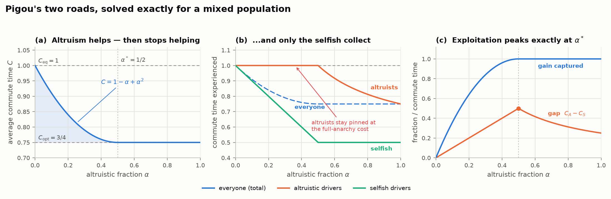

With a constant road `c₁ = 1` beside a congestible one `c₂ = x`, the mixed
equilibrium is piecewise closed-form. Selfish drivers overfill road 2; altruists
retreat to road 1 until road 2's usage drops to its optimal `1/2`:

| regime | | |
|---|---|---|
| `α ≤ 1/2` | `x₂ = 1 - α` | `C = 1 - α + α²` |
| `α ≥ 1/2` | `x₂ = 1/2` | `C = 3/4` (the social optimum) |

Three things fall straight out, and all three survive on the lattice:

* **Saturation at `α* = 1/2`.** Half the population being altruistic captures
  *the entire* achievable gain. Below that, the share captured is exactly
  `4α(1-α)` — the first altruists are worth far more than the last.
* **The altruists get none of it.** For all `α ≤ 1/2` an altruist experiences
  `C_A = 1`, exactly the full-anarchy commute time, while a selfish driver
  experiences `C_S = 1 - α`, improving all the way to `1/2`. The entire benefit
  of cooperation is transferred to the people who did not cooperate.
* **Exploitation peaks exactly where the gains run out.** The gap `C_A - C_S`
  rises to `1/2` at `α = 1/2` and then decays as `1/(4α)`.

Above `α*` altruists do finally start to benefit (`C_A = 1/2 + 1/(4α)`), but they
never catch the selfish, who sit at `1/2` throughout.

### 2. The paper, reproduced

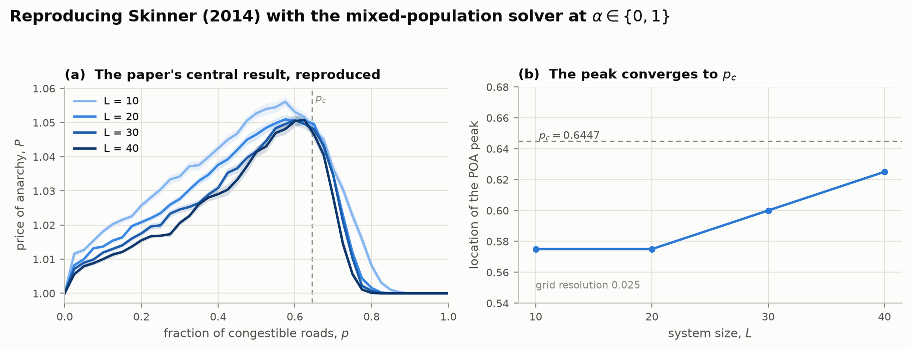
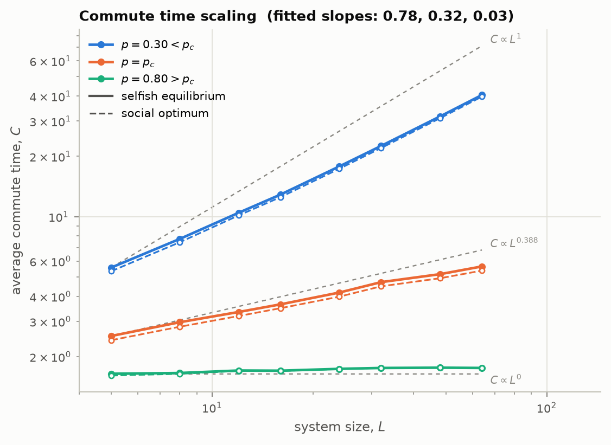

Setting `α ∈ {0, 1}` recovers Skinner's results: the price of anarchy peaks at
the directed-percolation threshold `p_c ≈ 0.6447`, sharpens with `L`, and the
peak location converges to `p_c`. The commute time scales as `C ∝ L¹` below
`p_c`, `C ∝ L⁰` above it, and as a nontrivial power at threshold.

### 3. Does altruism speed things up?

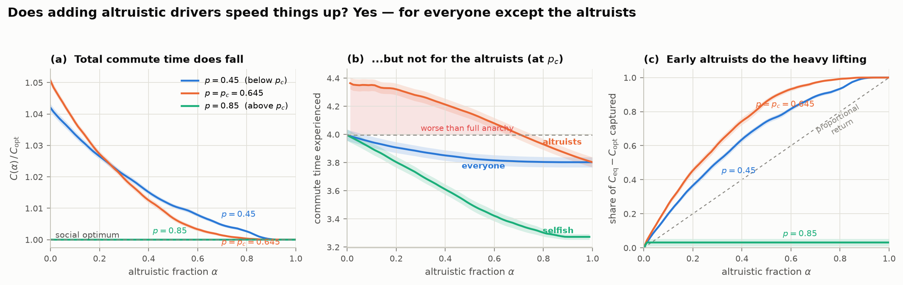

Yes — and the Pigou structure survives the disorder. Total commute time falls
with `α`, but the curve is strongly concave: the first altruists do most of the
work. At `p_c`, a quarter of the population being altruistic already captures
**53%** of the achievable gain and half captures **86%**.

The distributional picture is worse than Pigou's, though. At `p_c` the altruists'
own commute *starts above* the pure-anarchy cost and stays there across **69%**
of the `α` range — peaking at 9.2% worse than `C_eq`. On the lattice altruists
are strictly worse off than *anyone* was before altruism was introduced, not
merely no better off as in Pigou. Meanwhile the selfish drivers end up **14%
faster than the social optimum's average** — they are not just free-riding on the
gain, they are consuming more than all of it.

| at `p = p_c`, `L = 20` | value |
|---|---|
| price of anarchy `C(0)/C(1)` | 1.051 |
| gain captured at `α = 0.25` | 53% |
| gain captured at `α = 0.50` | 86% |
| mean saturating fraction `α*` | 0.64 |
| peak `C_A - C_S` | 0.66 (17% of `C_opt`) |
| altruists worse off than full anarchy | over 69% of the `α` range |
| best selfish commute vs `C_opt` | 14% faster |

### 4. What the percolation threshold actually controls

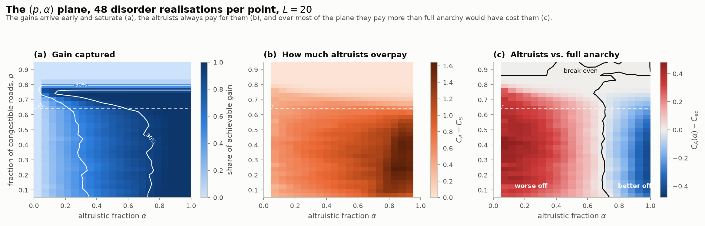
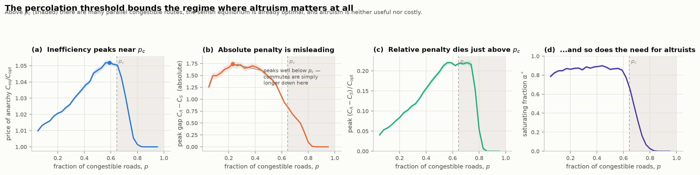

Skinner's result is that *inefficiency* is maximal at `p_c`, and that reproduces.
The distributional quantities behave differently, and it is worth being precise
about how — the naive guess that they also peak at `p_c` is wrong:

* The **absolute** altruist penalty `C_A - C_S` peaks near `p ≈ 0.23`, far below
  `p_c`. That is not a real effect: below `p_c` traffic must cross many constant
  roads, so `C ∝ L` and *every* time difference is larger down there.
* Normalised by the cost scale, `(C_A - C_S)/C_opt` instead rises to a **plateau
  of ≈ 22%** spanning roughly `0.55 < p < 0.78` — straddling `p_c` — and then
  collapses to zero within a few percent of `p_c`.
* The saturating fraction `α*` behaves the same way: ≈ 0.85 below `p_c`,
  falling through zero just above it.

So `p_c` is the **upper edge** of the regime in which altruism means anything,
not a peak in it. Above `p_c` there are many parallel all-congestible routes, the
selfish equilibrium is already optimal (`POA → 1`), and altruism is at once
worthless and costless. Below `p_c` there are gains to be had, and someone has to
pay for them.

### 5. Altruism can backfire

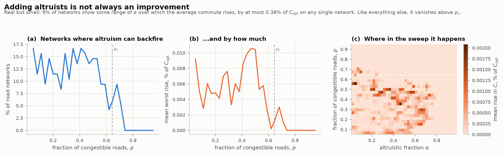

Because the mixed equilibrium minimises a potential rather than the total cost,
`C(α)` need not decrease. On a minority of random networks, converting selfish
drivers into altruists makes the *average* commute worse over a range of `α`.
This is a genuine effect, not solver noise: a certified example at `p = 0.4`,
`L = 10` dips to `C = 6.9965` at `α = 0.20` and then climbs to `C = 7.0286` at
`α = 0.28`, with all costs certified unique to 7 digits by `cost_range`.

It is also small, and worth not overselling: across 2976 random networks, 8.8%
show some backfiring range, the largest rise on any single network is 0.38% of
`C_opt`, and only 0.16% of all `(network, α)` pairs are actually worse than full
anarchy. Like everything else here, it vanishes above `p_c`.

### 6. Where each class drives

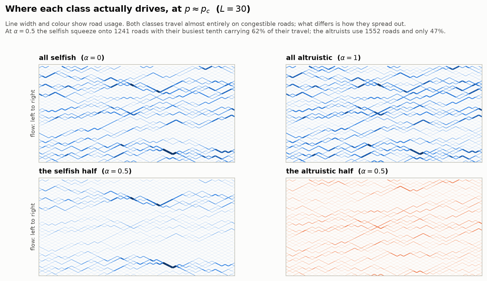

The intuitive story — "altruists take the slow roads" — turns out to be wrong,
and the data says so: at `p ≈ p_c` **both** classes do ~98% of their travel on
congestible roads. What actually differs is *concentration*. At `α = 0.5` the
selfish squeeze onto 1241 roads with their busiest tenth carrying 62% of their
travel; the altruists spread the same amount of traffic over 1552 roads, with
only 47% on their busiest tenth. Altruists do not avoid the fast roads — they
decline to pile onto the *same* fast roads, which is what leaves those roads
clear for the selfish. This matches the paper's own Fig. 10, where the optimum
has a visibly more even flow distribution than the equilibrium.

## Part II: what if drivers don't know which roads are fast?

The companion paper, *[The benefit of ignorance for traffic through a random
congestible network](https://arxiv.org/abs/2503.09684)* (Saray, Pozderac,
Josephson & Skinner), asks a different question of the same lattice: what if
drivers cannot reliably tell a fast road from a slow one? Each driver plans
against a **perceived** cost that blends the road's true cost function with the
other type's. With `u = ω/2`:

```
slow road (true c = 1):  c^p(x) = (1 − u) + u·x
fast road (true c = x):  c^p(x) = u + (1 − u)·x
```

`ω = 0` is perfect knowledge; `ω = 1` makes every road look identical. Their
striking result is that ignorance *helps*: it stops selfish drivers piling onto
the fast roads, and for any `ω ≤ 2/3` the price of ignorance `P_I = C(ω)/C(0)`
is below 1 at every `p`.

### 6. The ignorance paper, reproduced

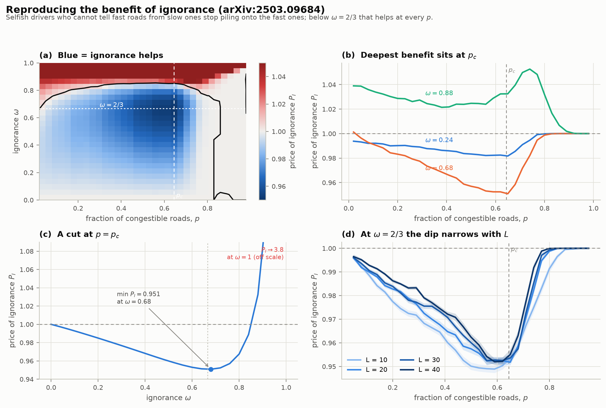

The two models compose with **no new solver**. Perceived costs stay affine, and
the mixed-equilibrium QP already accepts arbitrary affine coefficients — so
ignorance is just a transformation of `(a_e, b_e)`. Behaviour follows perceived
costs; outcomes are scored with true ones.

| check | paper | here |
|---|---|---|
| Pigou currents | `(ω/2, 1 − ω/2)` | exact |
| Pigou price of ignorance | `1 − (ω/2)(1 − ω/2)` | exact |
| `ω = 1` flow | uniform, `C = p + 2L(1−p)` | exact to 1e-15 |
| `P_I ≤ 1` for all `p` when `ω ≤ 2/3` | yes | max `P_I` = 1.0000 |
| minimum `P_I` | ≈ 0.95 near `p_c`, `ω ≈ 2/3` | 0.951 at `p = 0.65`, `ω = 0.68` |
| limit of useful ignorance below `p_c` | ≈ 6/7 = 0.857 | 0.840 |
| their Eq. 12 identity `F_{2/3} = C/3 + (1/6)Σ_slow x² + const` | — | holds to 1e-16 |

### 7. An ignorant altruist aims at the wrong target

This is the modelling choice that makes the two effects interact rather than
simply add. An altruist minimises the total commute time *as she believes it to
be*, so she responds to the **perceived** marginal social cost `a^p + 2b^p x`.
When `ω > 0` that is not the true marginal cost, so she misaims.

In Pigou this does not bite — the closed form extends cleanly, and it turns out
the minimiser of the perceived total cost coincides with the true optimum
`x₂ = 1/2` for *every* `ω`. So in the two-road network ignorance never corrupts
an altruist's aim, and altruism never hurts. What it does instead is become
**redundant**: for `α < ω/2` the altruists change nothing at all, and at `ω = 1`
the network is already optimal for every `α`.

On the lattice the coincidence fails, and the interaction is real.

### 8. Adding altruists can slow traffic down

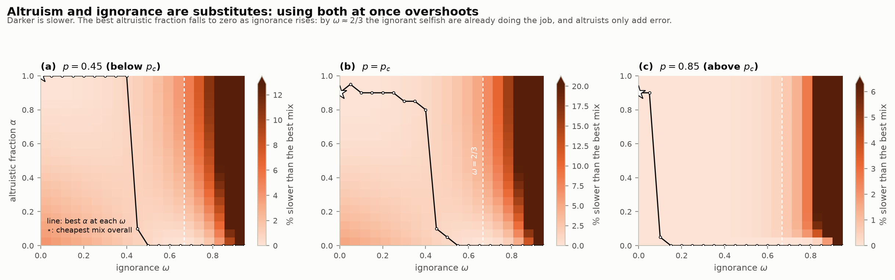
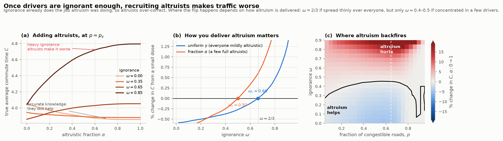

At `p_c` (`L = 20`, 32 realisations), four corners of the `(ω, α)` plane:

| population | `C` | vs best |
|---|---|---|
| selfish, informed (`ω=0, α=0`) | 4.056 | +5.20% |
| **altruistic, informed** (`ω=0, α=1`) | **3.855** | — |
| **selfish, ignorant** (`ω=2/3, α=0`) | **3.857** | +0.06% |
| altruistic *and* ignorant (`ω=2/3, α=1`) | 4.051 | +5.08% |

Two completely different populations — everyone altruistic and well-informed, or
everyone selfish and ignorant — land within 0.06% of the same optimum. Combining
both corrections is almost exactly as bad as applying neither.

So the answer to the original guess is **yes, and more strongly than expected**.
Going from `α = 0` to `α = 1` at `ω = 2/3` *raises* the commute time by 5.0% at
`p_c`, 3.8% at `p = 0.45` and 0.4% at `p = 0.85`. Across the whole `(p, ω)`
grid, altruism is harmful over **57%** of it.

### 9. The trade-off has a closed form

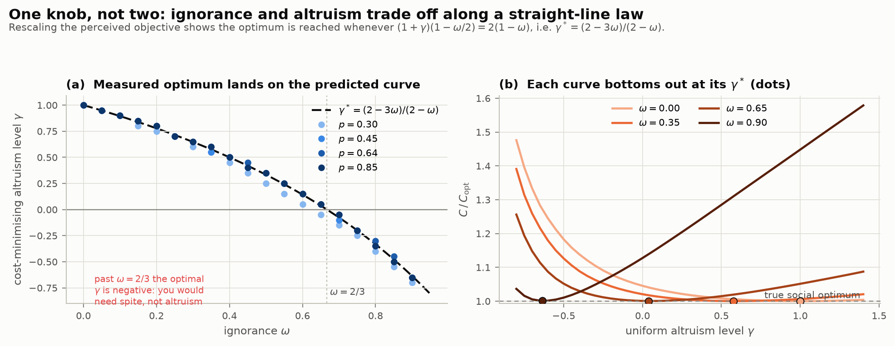

For a *uniform* population at altruism level `γ` (everyone responds to
`c + γ·x·c'`), the perceived objective can be rescaled — using the fact that
every path crosses exactly `2L` roads, so a constant per-road offset is free —
into

```
Σ_slow [ K·x + (u/(1−u))·x²/2 ]  +  Σ_fast x²/2 ,    K = (1−2u)/((1+γ)(1−u))
```

The true optimum is `K = 1/2`, giving

```
γ*(ω) = (2 − 3ω)/(2 − ω)
```

Three limits check out, and the third is the punchline:

* `γ*(0) = 1` — with perfect knowledge you need full marginal-cost routing.
* `γ*(2/3) = 0` — at the ignorance paper's threshold you need **no altruism at
  all**. Their `2/3` falls out of the altruism algebra, independently.
* `γ*(ω) < 0` for `ω > 2/3` — beyond that, the corrective role would have to be
  played by **spite**.

Measured against a brute-force scan over `γ` at four `p` values and 19 ignorance
levels, the law holds to a mean absolute error of **0.022** in `γ` (grid step
0.05). The residual is the `Σ_slow x²` term, which is exactly the term the
ignorance paper argues is subleading at large `L`.

### 10. How you deliver altruism changes when it backfires

The derivation above is for a uniform `γ`, but this repo's main model uses a
*fraction* `α` of fully-altruistic drivers. These are **not** equivalent, and the
difference is measurable:

| instrument | measured `ω` where a small dose stops helping |
|---|---|
| uniform `γ` — everyone mildly altruistic | **0.66** (analytic: `2/3` = 0.667) |
| fraction `α` — a few full altruists | **0.50** |

Spreading a little altruism over everyone keeps helping ~0.17 further in `ω`
than concentrating it in a few drivers. Concentrated altruists dump their entire
correction onto the handful of paths they take, overshooting there while leaving
the rest of the network untouched — a worse instrument for the same total amount
of altruism.

This also resolves an apparent contradiction. The threshold where the *first*
altruists stop helping (`ω ≈ 0.50`) is strictly below the `ω ≈ 0.68` that
minimises `C` for a purely selfish population. Both are correct: at the
cost-minimising `ω` any perturbation must raise `C`, so the flip is *guaranteed*
by then — but it can happen earlier, because the altruists' correction is not
aligned with whatever error remains.

## Part III: real road networks

The lattice results above rest on assumptions worth testing directly. This part
does that, in two steps: first breaking the single most load-bearing assumption
in an otherwise identical model, then re-running the whole question on actual
road networks.

### 11. The assumption that decides the answer

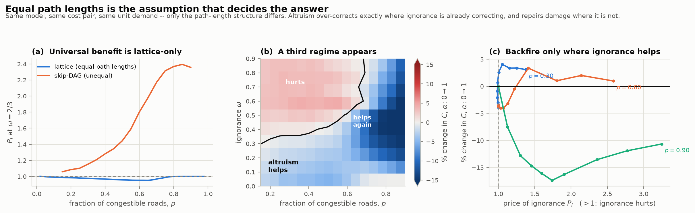

Every path through the paper's lattice crosses exactly `2L` roads. That is not
cosmetic — it makes `Σ_e x_e` the same for *every* feasible flow, which is the
"free direction" the `γ*` derivation uses, and it means ignorance can never send
a driver down a genuinely longer route.

`poi.irregular.skip_dag` keeps everything else identical — same two road types,
same `c = 1` / `c = x` pair, same unit demand — and adds links that jump two
layers, so path lengths run 15–24 roads instead of exactly 24. Results:

| | lattice | unequal path lengths |
|---|---|---|
| `P_I ≤ 1` at `ω = 2/3` | for **100%** of `p` | for **0%** of `p` (1.06 → 2.39) |
| altruism flips sign at | `ω ≈ 0.45–0.50` | `ω ≈ 0.45` |
| altruism hurts over | 57% of the grid | 38% of the grid |

So the *altruism reversal survives* — the flip point barely moves — while the
ignorance paper's headline result, that ignorance below `ω = 2/3` helps at every
`p`, **does not**. It is specific to equal-length paths. (This is not a criticism
of that paper, whose model is explicitly the equal-length lattice; it is the
first thing to check before carrying the result outside.)

A third regime also appears, absent from the lattice: at high `p`, where
ignorance does real damage, altruists **repair** it rather than over-correcting —
up to −17% at `p = 0.90, ω = 0.5`. Panel (c) makes the rule plain: altruism
backfires only where `P_I ≲ 1`, i.e. only where ignorance is already doing the
corrective work.

### 12. Actual road networks

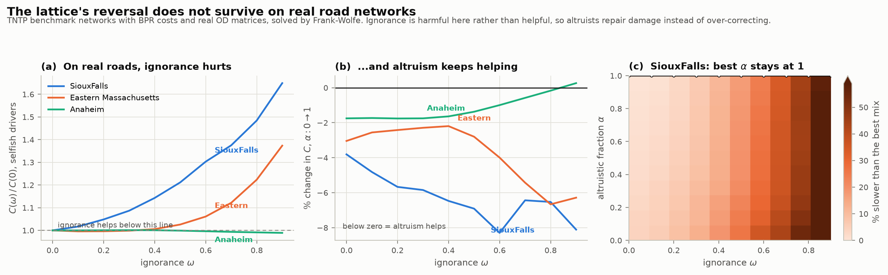

`poi.bpr` reads the [Transportation Networks](https://github.com/bstabler/TransportationNetworks)
benchmark format and solves the mixed equilibrium by Frank-Wolfe.

**The potential generalises.** The `λ` rescaling is not affine-specific. Symmetry
of the VI Jacobian needs `λ(2c' + x c'') = c'`, and for any power law
`x c'' = (β−1)c'`, so `λ = 1/(β+1)` — a constant, `1/2` for affine and `1/5` for
BPR. The offset between the classes is then also constant, so

```
Φ(f^A, f^S) = Σ_e ∫₀^{x_e} c_e(s) ds  −  Σ_e [t⁰_e · β/(β+1)] · f^A_e
```

Beckmann's integral plus a per-link discount only altruists receive, proportional
to free-flow time. Altruists behave exactly as if distance mattered less and
congestion more. Convex, so Frank-Wolfe applies.

Validation: Sioux Falls user equilibrium comes out at **7,479,953** against the
published ~7,480,225, price of anarchy 1.0396 (published ~1.04), flow
conservation to 1e-10.

**Costs and ignorance on a real network.** Costs are the BPR functions shipped
with the data, `c(x) = t⁰(1 + 0.15 (x/cap)⁴)`; nothing is invented. There are no
road *types* to blend between, so ignorance instead shrinks each link's capacity
toward the network geometric mean in log space, collapsing Sioux Falls' 5.4×
capacity spread to 2.3× at `ω = 0.5` and to 1.0× at `ω = 1`. Free-flow time is
left alone by default — drivers know roughly how far things are, but misjudge how
easily a road clogs.

**The result reverses the lattice's conclusion:**

| | Sioux Falls | E. Mass. | Anaheim |
|---|---|---|---|
| price of anarchy | 1.0396 | 1.0314 | 1.0178 |
| `P_I` at `ω = 2/3` (lattice: ~0.95) | **1.351** | **1.101** | 0.994 |
| altruism effect at `ω = 0` | −3.8% | −3.0% | −1.8% |
| altruism effect at `ω = 2/3` (lattice: **+5%**) | **−7.1%** | **−5.0%** | −0.7% |
| altruism flips sign | never | never | `ω = 0.9` |

Ignorance costs up to **65%** extra travel time on Sioux Falls. Altruism helps
everywhere, and helps roughly **twice as much** when drivers are ill-informed.
The best mix on all three networks is `ω = 0, α = 1` — informed altruists.

The two findings are consistent: altruism over-corrects only when ignorance is
already correcting. Real networks, with their unequal path lengths, sit in the
regime where ignorance damages rather than corrects, so altruism repairs.

**Policy reading, revised.** The lattice suggested navigation apps and congestion
pricing were substitutes that could over-correct together. On real networks the
opposite holds: better information and marginal-cost routing are *complements*,
and the case for altruistic routing is strongest exactly where drivers are worst
informed.

## Part IV: what if drivers are wrong *independently*?

Everything so far models ignorance as a **systematic bias** — every driver
perceives the same wrong cost, in the same direction. Real perception error is
partly idiosyncratic and partly shared, because drivers read the same signs and
the same navigation app. `poi/stochastic.py` spans the two with one knob:

```
ε^k_e = σ · ( √ρ · ξ_e  +  √(1−ρ) · η^k_e )
```

`ξ` is drawn once per link and shared; `η` is drawn per driver type. `Var(ε) = σ²`
for every `ρ`, so **magnitude and correlation move independently**. `ρ = 1` is the
papers' regime; `ρ = 0` is textbook stochastic user equilibrium.

**Why it stays convex.** The error is additive and *flow-independent*, so every
type's Jacobian row is `c'(x)` — symmetric, hence a potential exists:

```
Φ({f^k}) = Σ_e ∫₀^{x_e} c_e  +  Σ_k Σ_e δ^k_e · f^k_e
```

with `δ = ε` for a selfish type and `δ = −disc + ε/(β+1)` for an altruistic one.
Randomising *which type a road is*, or its capacity, would perturb `b_e` instead,
break the symmetry, and leave no potential — that variant needs a
variational-inequality solver and is not attempted here. Two independent
implementations agree: a `K`-type multi-class QP/Frank–Wolfe with Gaussian link
errors, and `dial_logit`, which solves the `ρ = 0` Gumbel continuum exactly by
Dial's algorithm on the acyclic lattice (no Monte Carlo, no path enumeration).

### 13. Correlation, not magnitude, decides the sign

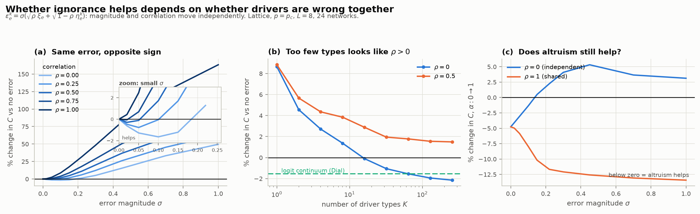

At `p_c` on the lattice, the best achievable benefit and the damage at `σ = 1`:

| `ρ` | best benefit | at `σ` | damage at `σ = 1` |
|---|---|---|---|
| 0.00 | **−1.65%** | 0.10 | +50% |
| 0.25 | −0.78% | 0.05 | +63% |
| 0.50 | −0.30% | 0.02 | +79% |
| 0.75 | −0.07% | 0.02 | +103% |
| 1.00 | **none** | — | +163% |

The beneficial window shrinks monotonically with correlation and **closes
entirely at `ρ = 1`**, while the damage at large `σ` triples. Shared error is
categorically the more dangerous kind.

**A methodological trap worth flagging.** Finite `K` is itself a correlation
knob — a handful of types is a handful of coordinated groups. At `σ = 0.10`,
`ρ = 0`: `K = 1` reads **+8.65%** (harmful), `K = 16` is neutral, `K = 256` is
**−2.14%**. I got the sign of this result wrong on my first pass by using
`K = 12`. The Dial continuum independently gives −1.55% at `θ = 10`, from an
entirely different error structure.

### 14. Altruism reverses — but on the other side

The altruism effect (`α: 0 → 1`) across `σ`:

| | σ=0 | 0.05 | 0.15 | 0.30 | 0.45 | 1.00 |
|---|---|---|---|---|---|---|
| `ρ = 0` | −4.8% | −3.1% | **+0.5%** | +4.1% | +5.3% | +3.1% |
| `ρ = 1` | −4.8% | −5.8% | −10.2% | −12.1% | −12.6% | **−13.4%** |

I predicted the reversal was a `ρ ≈ 1` phenomenon that would dissolve as `ρ → 0`.
**That was exactly backwards.** Altruism reverses under *independent* error and
becomes steadily more valuable under *shared* error.

The underlying rule from Part III survives intact, though, and explains both:
altruism backfires precisely where the uncertainty is **already doing corrective
work**. Independent error mildly corrects (it is the only regime with a
beneficial window), so altruists over-correct on top of it. Shared random error
only damages, so altruists repair. The same rule covered the tuned `ω` bias,
which corrects by construction and so also produced a reversal.

### 15. Off the lattice

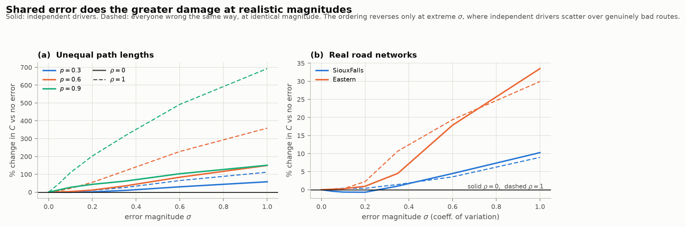

On unequal path lengths and on real road networks, independent error is far
gentler than shared error over the range that matters — at `p = 0.9, σ = 0.35` on
the skip-DAG, +62% versus +317% — but the benefit is small or absent. Sioux Falls
gets at most **−0.69%** from independent error (`σ = 0.2`; −0.79% at `K = 96`),
and Eastern Massachusetts gets nothing. The ordering does reverse at extreme `σ`,
where independent drivers scatter over genuinely bad routes while a shared bias
at least keeps everyone coherent.

Altruism helps on both real networks at every `σ` and every `ρ` tested, by 3–11%.

## Part V: would anyone *choose* to be altruistic?

Parts I–IV set the altruistic fraction `α` by hand. But part I's own result is
that the altruists are the ones paying: over 69% of the `α` range on the lattice
they travel *slower* than they did under full anarchy, while the selfish free-ride
14–17% below the social optimum. If drivers can see how their neighbours did and
copy whoever got home sooner, `α` stops being a dial and becomes a state variable.

`poi/evolution.py` puts the standard two-strategy imitation (replicator) dynamics
on top of the class costs every solver already returns. Writing
`D(α) = C_A(α) − C_S(α)` for the journey-time penalty of being the altruist,

```
dα/dt = α(1−α)·(−D(α))  +  μ·(1/2 − α)
```

The first term is imitation; the optional `μ` is a small mutation rate that makes
the boundaries leaky, so *"can altruism invade?"* has an answer that does not
depend on the initial condition. Nothing in the module re-solves a network — it
takes a sampled `D(α)` curve — so the same code answers the question on the
lattice QP, on the BPR networks and under stochastic error. The sign of `D` is
the entire dynamics: `α` falls wherever altruists pay and rises wherever they
don't.

Two boundary values decide almost everything. `D(0) < 0` means a *lone* altruist
in a fully selfish crowd already arrives sooner — altruism invades. `D(1) > 0`
means a *lone defector* in a fully altruistic crowd does better — altruism is
invadable. Both are extrapolated from the two nearest interior samples, since
`C_A` is undefined at `α = 0` and `C_S` at `α = 1`.

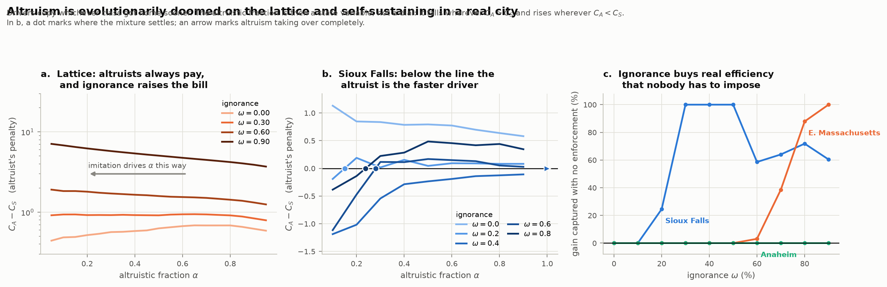

### 16. On the lattice, altruism is doomed — and ignorance makes it worse

`D(0) > 0` in all 60 `(p, ω)` cells of the joint surface. Not one of them lets
altruism get started, and the penalty *grows* steeply with ignorance:

| `p` | `ω = 0` | `ω = 0.3` | `ω = 0.6` | `ω = 0.9` |
|---|---|---|---|---|
| 0.45 | +0.47 | +1.24 | +2.79 | +9.05 |
| 0.645 (`p_c`) | +0.40 | +0.89 | +1.99 | +7.39 |
| 0.85 | +0.00 | +0.02 | +0.22 | +3.60 |

So the lattice gives the bleakest possible answer: the socially useful strategy
is the individually expensive one everywhere, ignorance makes the sacrifice
larger rather than smaller, and imitation drives the population to `α = 0` — the
price of anarchy — from any starting mixture. Part II's finding that altruism
*hurts* past `ω ≈ 0.45` is not even needed; altruism does not survive long enough
for it to matter.

The decay is slow, though, not sharp. In Pigou's two roads the gap closes
linearly at the boundary (`D ≈ α`), so the velocity is quadratic and altruism
dies off like `1/t` rather than exponentially.

### 17. On a real road network, ignorance is exactly what keeps altruism alive

The real networks reverse it. On Sioux Falls a lone altruist is *slower* than the
crowd when everyone knows the roads (`D(0) = +1.42`), but once drivers misjudge
them the sign flips and stays flipped:

| `ω` | `D(0)` | `D(1)` | settled `α*` | gain captured |
|---|---|---|---|---|
| 0.0 | +1.415 | +0.524 | 0.000 | 0% |
| 0.2 | −0.572 | +0.081 | 0.150 | 25% |
| 0.4 | −1.357 | −0.092 | takeover | 100% |
| 0.6 | −1.759 | +0.003 | 0.280 | 59% |
| 0.8 | −0.630 | +0.250 | 0.238 | 72% |

Eastern Massachusetts crosses over at `ω = 0.6` and captures **88%** of the
achievable gain at `ω = 0.8` from a settled `α* = 0.20`. Anaheim never crosses
over — it is the least congested of the three (price of anarchy 1.018), so there
is almost no externality for altruism to profit from.

The mechanism is the one that explains Parts II–IV as well. An ignorant selfish
crowd piles onto roads it *believes* are fast. The altruist is routing on
perceived *marginal* cost, so she steps off exactly those roads — and under
ignorance the roads the crowd has mistakenly avoided really are faster. Being
unselfish and being right coincide. She is not making a sacrifice at all; she is
the only driver whose objective function accidentally corrects for the bias.

Two consequences worth stating plainly:

* **A mixed population is the generic outcome, not a knife edge.** `D` crosses
  zero *upwards*, so the interior rest point attracts from both sides: too many
  altruists and defecting pays, too few and converting pays. `α*` between 0.15
  and 0.28 on Sioux Falls is stable, not tuned.
* **The efficiency is free.** Nobody enforces `α*`; it is where self-interested
  copying lands. On Sioux Falls at `ω = 0.8` that is 72% of the entire gap
  between anarchy and the social optimum, with no tolls, no mandates and no
  coordination.

The one caveat: `D(1) = −0.092` at `ω = 0.4` is an extrapolation, so "complete
takeover" there means the altruist is still ahead at the last sampled point
(`α = 0.9`, `D = −0.109`), and the curve's slope carries it past 1.

### 18. Random error: correlation decides survival, magnitude decides how much

Part IV's headline was that the *correlation* of driver error, not its
magnitude, decides whether uncertainty helps or hurts. The evolutionary question
answers the same way, and more sharply.

Settled altruistic fraction `α*` on the lattice at `p_c`, from `α₀ = 0.5`
(`L = 8`, `K = 48` driver types, 12 layouts):

| `ρ` \ `σ` | 0 | 0.05 | 0.1 | 0.2 | 0.3 | 0.45 | 0.7 |
|---|---|---|---|---|---|---|---|
| 0 | 0 | 0 | 0 | 0 | 0 | 0 | 0 |
| 0.25 | 0 | 0 | 0 | 0 | 0 | 0 | 0 |
| 0.5 | 0 | 0 | 0 | 0 | 0 | 0 | 0 |
| 0.75 | 0 | 0 | 0 | **0.13** | **0.24** | **0.43** | **0.63** |
| 1 | 0 | 0 | **0.11** | **0.84** | **0.82** | **0.86** | **1.00** |

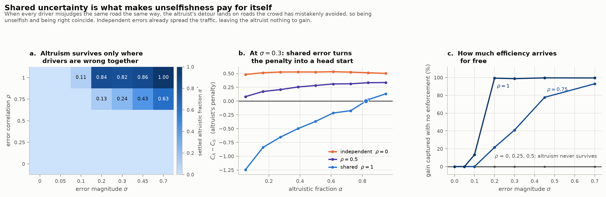

Below `ρ = 0.75` altruism dies at *every* magnitude tested — piling on more
uncertainty never rescues it. Above it, altruism invades as soon as the error is
large enough to matter, and the fraction it settles at rises with `σ`.

The efficiency this buys is close to total. At `ρ = 1` and `σ ≥ 0.2` the settled
population captures **99%** of the entire gap between anarchy and the social
optimum — no tolls, no mandates, no coordination, just drivers copying whoever
got home sooner. At `ρ = 0.75` it climbs from 22% at `σ = 0.2` to 93% at
`σ = 0.7`.

This is the flip side of Part IV's finding 14, and the two now fit together as
one statement. Independent error *already* scatters traffic off the crowded
roads, which is why it lowers the average commute (−1.65% at `ρ = 0`) and why an
altruist adds nothing — she pays for a correction that has already happened
(`D(0) = +0.36` and rising). Shared error moves everybody the same wrong way, so
nothing is corrected: the average commute is worse (+163% at `σ = 1`), the
altruist's marginal-cost routing is the only thing pointing at the right roads,
and she is rewarded for it (`D(0) = −1.43` at `σ = 0.3`). Uncertainty that helps
crowds out altruism; uncertainty that hurts recruits it.

### 19. Random error on real road networks

The same test on Sioux Falls and Eastern Massachusetts (`K = 12` driver types,
BPR costs, multi-class Frank–Wolfe) agrees on direction and disagrees on scale.

| network | `ρ` | `σ = 0` | 0.1 | 0.2 | 0.4 | 0.7 |
|---|---|---|---|---|---|---|
| Sioux Falls | 0 | +1.28 | +1.14 | +1.04 | +0.40 | **−0.06** |
| Sioux Falls | 1 | +1.28 | +1.00 | +0.70 | **+0.02** | **−0.98** |
| E. Massachusetts | 0 | +0.033 | +0.028 | +0.033 | +0.032 | **−0.013** |
| E. Massachusetts | 1 | +0.033 | +0.031 | +0.013 | **−0.011** | **−0.015** |

(the lone altruist's penalty `D(0)`; bold where altruism is at or past invasion)

Three differences from the lattice are worth stating:

* **Same direction, weaker lever.** Shared error still moves the system toward
  altruism faster than independent error at every `σ` on both networks — Eastern
  Massachusetts crosses over one step earlier at `ρ = 1` — but the correlation
  gap is nothing like the lattice's clean `ρ = 0.75` threshold. Real networks
  need a genuinely large error before anything happens, and then both
  correlations get there.
* **No mixed equilibrium.** `D` flips sign along its whole length rather than
  crossing zero in the interior, so the outcome is all-or-nothing: altruism
  either dies or takes over completely. The stable interior mixtures of finding
  17 are a feature of *systematic* ignorance, not of random error.
* **It arrives only once the error is doing real damage.** Sioux Falls flips
  between `σ = 0.4` and `σ = 0.7`, where random error has stopped helping and is
  costing +4 to +5% of average commute; Eastern Massachusetts flips at `σ = 0.4`
  (`ρ = 1`), costing +10%. Which is the rule again, from the harshest side:
  altruism becomes individually worthwhile exactly when the uncertainty has
  become bad enough to leave real damage for it to repair.

**The rule from Parts II–IV survives intact, and now cuts both ways.** Altruism
backfires exactly where something else is already correcting the traffic — and in
precisely those regimes it also cannot pay its own way, so it would not be
adopted even if it did help.

## Caveats

* Costs are affine (`c = 1` or `c = x`), matching the paper. Roughgarden–Tardos
  bounds the price of anarchy by `4/3` here; nonlinear or jamming costs would
  make every effect larger.
* "Altruistic" means *myopically* altruistic — routing on marginal social cost,
  taking others' choices as given. A central planner who anticipated the selfish
  response (Stackelberg routing) would do better, and is a bilevel problem, not
  a QP.
* Parts I–III model ignorance as a *bias*; Part IV adds the idiosyncratic case
  and shows the correlation matters more than the magnitude. What is still not
  modelled is error on the *congestion* parameters: randomising `b_e` or a link's
  capacity per driver destroys the potential-function structure, so that variant
  needs a variational-inequality solver.
* The real-network stochastic runs use `K = 12` driver types for cost. That
  slightly understates the `ρ = 0` benefit (−0.69% versus −0.79% at `K = 96` on
  Sioux Falls), so those numbers are conservative rather than wrong.
* The real-network ignorance model is *analogous* to the lattice one, not
  identical: `ω` is not on the same scale in the two settings, so only the
  qualitative endpoints are comparable.
* Frank-Wolfe converges sublinearly. Reported relative gaps are median 3.5e-6,
  max 1.2e-3 (7 of 330 cells, all in Eastern Massachusetts); differences below
  ~0.2% on that network should be treated as unresolved.
* The evolutionary results read the sign of `C_A - C_S`, a *difference* between
  two class averages, which is a harder quantity for a solver than the total
  cost. On the lattice it is exact to `~1e-6`. On the real networks it rests on
  Frank-Wolfe: most cells have a relative gap below `1e-4`, but Eastern
  Massachusetts at `ρ = 1, σ = 0.4` reaches `1.4e-3`, so that one crossover is
  suggestive rather than settled.
* Imitation assumes a driver can observe another class's outcome and switch
  freely. It is the standard model, but it makes the altruistic fraction respond
  only to *realised* travel time — an altruist who values having behaved well
  regardless of her commute is outside it, and would shift every threshold here.
* `γ*(ω)` is derived by dropping the `Σ_slow x²` term. That term is subleading
  in `L` (the ignorance paper's argument), which is why the law is accurate to
  ~0.02 rather than exact, with the largest deviation at small `p` where the most
  traffic sits on slow roads.
* The boundary condition is the paper's circuit analogy: left and right
  boundaries are equipotential busbars. `entry="uniform"` forces `1/L` in at each
  left vertex instead; results are qualitatively identical (tested).
* Interior-point solutions pinned to a vertex carry `~1e-6` absolute error. Every
  effect reported here is `1e-2` or larger.
